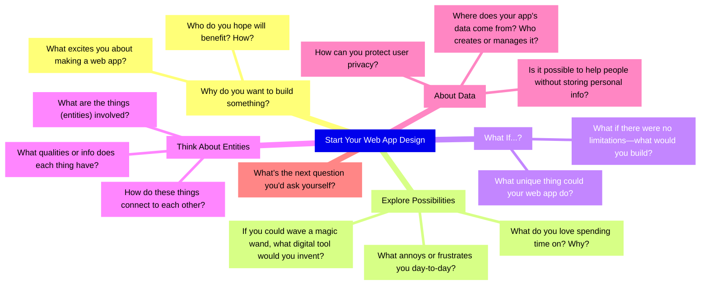

# Design Your Own Web App

The code we have been working with recently is especially suited to joining people to data without storing any PII(?) in your app.

* Todo Lists
* Fitness Trackers
* Collection trackers
* Want / Shopping lists

---

## Do you have a hobby?

You you collect things or track a team or band?

---

## What?

* What problem would you like to solve.
* What do you want to record, calculate, map or workout? 
* https://tinyurl.com/OLPProjectIdeas

### Write it down

---

## Entities

* What **things/entities** are in that?
* What properties do they have
* Who has that information?

---

## Mind Mapping Might Help

[https://tinyurl.com/WebAppMindMap](https://tinyurl.com/WebAppMindMap)

---

## Planning

What is in a plan for a piece of software?

---
## Decide on a name & simple design

* **Name** What is it called?
* **Purpose** What is it for? 
	* What problem are you trying to solve?
	* Who needs it and what are there needs?
* **Success Criteria** What does Success look like?
	* How will you know it works?
* **Analysis** 
	* **Entities** What thing will you store info about?
	* **Inputs**, **Outputs**, **Processing** & **Storage**?

---

Talk to sir to check it.
### Commit & Push Your todo-app

---

## Fork your todo-app

* Use Github Desktop to get you new project locally
* Copy the .env file from your Todo app
* Run it and you should see the Todo App working
* Commit & Push it and add the link to the Assignment in Teams

---

## Start changing the names

* Classes, functions and variables cans be changed with F2
* Change the variables in the  templates and everything else to match
* Talk to each other about what breaks

